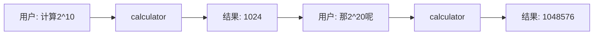

# Delta: Memory

**Change ID:** `chatbot-agent-upgrade`
**Affects:** `backend/app/memory/`

---

## 设计来源

本模块的设计参考了 TencentDB-Agent-Memory 的架构理念：
- **记忆分层（Memory Layering）**：拒绝扁平向量堆叠，采用渐进式披露的分层结构
- **符号记忆（Symbolic Memory）**：用最少 token 承载最大语义，支持逐层下钻追溯
- **上下文卸载（Context Offloading）**：长工具日志外存，上下文只保留精要

---

## ADDED

### Requirement: 记忆分层架构（4-Tier）

记忆系统按 4 层组织，从底层原始数据到顶层用户画像，逐层抽象：

```
L3 Persona（用户画像）         ← 顶层：偏好、风格、常见需求模式
    ↑ 下钻
L2 Scenario（场景总结）         ← 中间：每次会话的主题和关键产出
    ↑ 下钻
L1 Atom（原子事实）             ← 细粒度：工具调用结果中的关键事实
    ↑ 下钻
L0 Conversation（原始对话）     ← 底层：完整的消息交换记录
```

**存储策略**（异质存储 + 渐进披露）：

| 层级 | 存储介质 | 存储格式 | 何时加载 |
|------|---------|---------|---------|
| L0 | SQLite | JSON rows | 按需，仅调试或精确回溯时 |
| L1 | SQLite | JSON rows（事实三元组） | Agent 判断需要精确事实时 |
| L2 | 文件系统 | Markdown | 新会话开始时加载最近场景 |
| L3 | 文件系统 | Markdown | 始终加载（≈1KB） |

**可追溯性**：每一层都保留指向下层的引用 ID，从 L3 可顺链钻到 L0 原始证据。

#### Scenario: 首次对话，无历史
- GIVEN 新 session，L0-L3 均为空
- WHEN 用户发送第一条消息
- THEN Agent 仅加载默认 system prompt，无历史记忆

#### Scenario: 有历史画像，新会话开始
- GIVEN session 已存在 L3 Persona 和 L2 Scenario
- WHEN 用户开始新会话
- THEN Agent 自动将 L3 + 最近 3 个 L2 加载到上下文中

#### Scenario: Agent 需要核实一个事实
- GIVEN L3 提到"用户偏好 React"，但 Agent 觉得不够确定
- WHEN Agent 触发 `memory_search` 工具，查询 recent React project
- THEN L1 Atom 返回相关原子事实，附带指向 L0 原始对话的引用 ID

---

### Requirement: L0 Conversation — 原始对话存储

`app/memory/l0_conversation.py` — 存储完整的消息交换记录。

- 每条消息记录：role (user/assistant/tool)、content、timestamp、token_count
- 存储引擎：SQLite，按 session_id 分区
- 保留上限：每个 session 最多 500 条消息（超出自动清理最旧 50 条）
- 工具日志过长（>1000 字符）时触发上下文卸载（见下文）

```
表: conversations
──────────────────────────────────────────────
id | session_id | role | content | tokens | tool_name | tool_args | created_at
```

#### Scenario: 新消息写入
- GIVEN 用户发送一条 500 token 的消息
- WHEN Agent 回复完成后
- THEN L0 写入一条 user 记录和一条 assistant 记录，包含各自 token 数

#### Scenario: 精准回溯
- GIVEN Agent 通过 L1 Atom 引用 "conv_ref: 42"
- WHEN 系统查询 L0 id=42
- THEN 返回该条原始对话的完整内容

---

### Requirement: L1 Atom — 原子事实提取

`app/memory/l1_atom.py` — 从工具调用和对话中提取结构化事实。

- 事实格式：`(subject, predicate, object, source_ref, confidence, created_at)`
- 提取时机：Agent 每次回复完成后异步执行
- 提取来源：工具调用返回的关键结果 + 用户陈述的明确偏好
- 提取方式：用 LLM 对最近一轮对话做一次轻量提取（`extract_facts` 函数，单次调用约 200 token）

```
表: atoms
──────────────────────────────────────────────────────────
id | session_id | subject | predicate | object | source_ref | confidence | created_at
```

**事实示例：**
| subject | predicate | object | confidence |
|---------|----------|--------|:---------:|
| user | prefers | React for frontend | 0.8 |
| project | stack is | Python FastAPI | 0.9 |
| last_search_result | was | "Beijing weather 25°C" | 1.0 |

#### Scenario: 工具调用后提取事实
- GIVEN Agent 调用 web_search 查询 "北京天气"
- WHEN L1 提取执行
- THEN 生成事实 `("Beijing_weather", "temperature", "25°C", 1.0)`，source_ref 指向 L0 中工具调用的 id

#### Scenario: 用户表达偏好
- GIVEN 用户说 "我喜欢用 Vue"
- WHEN L1 提取执行
- THEN 生成事实 `("user", "prefers", "Vue for frontend", 0.7)`，confidence 低于工具结果

---

### Requirement: L2 Scenario — 场景总结

`app/memory/l2_scenario.py` — 将一次会话总结为一个场景块，以 Markdown 存储。

- 触发时机：会话结束（`DELETE /api/sessions/{id}` 或 30 分钟无活动）
- 内容：会话主题、关键决策、工具使用记录、产出物
- 存储格式：Markdown 文件 `offloads/scenarios/{session_id}_{date}.md`
- 保留上限：最近 50 个场景

**场景文件示例：**
```markdown
# Scenario: 天气查询和项目讨论

**Session:** abc123 | **Date:** 2026-05-17 | **Turns:** 8

## 主题
用户查询北京天气，并讨论了 Chatbot 项目的技术栈选型。

## 关键决策
- 决定使用 FastAPI + React 作为技术架构
- 选择智谱 GLM-4-Flash 作为默认模型

## 工具使用
- web_search: 查询北京天气（结果: 25°C, 晴）

## 关键事实 (→ L1)
- user prefers React for frontend
- project stack is Python FastAPI

## L0 引用
- conv_ref: 42-49  (工具调用和偏好讨论)
```

#### Scenario: 会话自动结束
- GIVEN 用户对话后 30 分钟没有新消息
- WHEN 后台定时任务检查到超时
- THEN 生成 L2 Scenario Markdown 文件，同时更新 L3 Persona

---

### Requirement: L3 Persona — 用户画像

`app/memory/l3_persona.py` — 从 Scenarios 和 Atoms 聚合出用户画像。

- 存储：`offloads/persona.md`
- 内容：用户技术偏好、常见需求模式、常用工具、沟通风格
- 更新时机：每次 L2 Scenario 生成后增量更新
- 大小控制：始终 ≤2KB，超出则压缩（保留最强信号）

**画像文件示例：**
```markdown
# Persona

## 技术栈偏好
- 前端: React / Vue（偏好 React）
- 后端: Python FastAPI
- 数据库: PostgreSQL / SQLite

## 常见需求
- 天气查询、代码实现、技术调研

## 沟通风格
- 简洁、结论先行

## 来源场景
- scenario_20260517_abc123 → persona 第 1 版
- scenario_20260518_xyz789 → persona 更新（新增 Vue 偏好）
```

#### Scenario: 首次生成 Persona
- GIVEN 已有 3 个 L2 Scenario
- WHEN 下一个场景生成后触发聚合
- THEN 生成 `offloads/persona.md`，包含从 Scenarios 中提取的共同模式

#### Scenario: 多次会话后 Persona 更新
- GIVEN persona.md 已存在
- WHEN 新场景总结完成
- THEN persona.md 内容增量更新：新模式追加，低频模式衰减或移除

---

### Requirement: 上下文卸载（Context Offloading）

借鉴 TencentDB-Agent-Memory 的 **Mermaid 符号化 + 日志外存** 模式。

- 触发条件：任何工具调用的输出超过 **1000 字符** 或 **200 token**
- 卸载操作：
  1. 完整输出写入 `offloads/refs/{session_id}_{tool_name}_{timestamp}.md`
  2. 上下文只保留一行摘要 + `result_ref: {文件名}`
  3. 提供 `read_ref` 工具，Agent 可通过该工具按需读取完整内容
- Mermaid 状态图（可选）：将当前会话的关键步骤渲染为 Mermaid 画布，保存到 `offloads/canvas_{session_id}.mmd`

#### Scenario: 搜索返回大量结果
- GIVEN web_search 返回 10 条结果（约 3000 字符）
- WHEN 上下文卸载器检测到超限
- THEN 结果写入 `offloads/refs/abc123_websearch_20260517T1200.md`；上下文中替换为 `📎 [搜索结果: 前 3 条摘要 + result_ref: abc123_websearch_20260517T1200.md]`

#### Scenario: Agent 需要查看完整结果
- GIVEN Agent 的上文中只有搜索结果的摘要
- WHEN Agent 调用 `read_ref("abc123_websearch_20260517T1200.md")`
- THEN 返回该文件的完整内容

#### Scenario: Mermaid 会话画布
- GIVEN 会话涉及多个工具调用（计算器 → 搜索 → 回复）
- WHEN 每个工具完成
- THEN 画布 `canvas_{session_id}.mmd` 追加一个节点：



---

### Requirement: Memory 管理器统一入口

`app/memory/manager.py` 作为统一入口，协调 4 层记忆 + 卸载逻辑。

```python
class MemoryManager:
    def get_context(self, session_id: str) -> str:
        """返回当前会话的记忆上下文（L3 + L2 + L1 摘要）"""

    def record_message(self, session_id: str, role: str, content: str, tokens: int):
        """记录 L0 对话"""

    def extract_atoms(self, session_id: str):
        """异步执行 L1 原子事实提取"""

    def finalize_scenario(self, session_id: str):
        """生成 L2 场景总结 + 更新 L3 Persona"""

    def offload_if_needed(self, tool_name: str, content: str, session_id: str) -> str:
        """判断是否需要卸载，返回摘要行（含 result_ref）"""

    def read_ref(self, ref_path: str) -> str:
        """读取卸载的外存内容"""

    def clear_session(self, session_id: str):
        """清理会话所有内存 + 卸载文件"""
```

#### Scenario: 完整生命周期
- GIVEN session "abc123" 从创建到结束
- WHEN 用户消息 → Agent 执行 → 工具调用 → 回复
- THEN 调用链：
  1. `get_context("abc123")` → 加载 L3 + 最近 L2
  2. `record_message("abc123", "user", "...")` → 存 L0
  3. 工具超长 → `offload_if_needed("web_search", result)` → 返回摘要
  4. `record_message("abc123", "tool", summary)` → 存 L0（摘要版）
  5. Agent 完成 → `extract_atoms("abc123")` → 生成 L1
  6. 会话结束 → `finalize_scenario("abc123")` → L2 + L3

---

## MODIFIED

(None — 本模块完全新建)

## REMOVED

- 原方案中的 `ConversationSummaryBufferMemory`（被分层架构替代）
- 简单滑动窗口策略（被分层 + 卸载替代）
